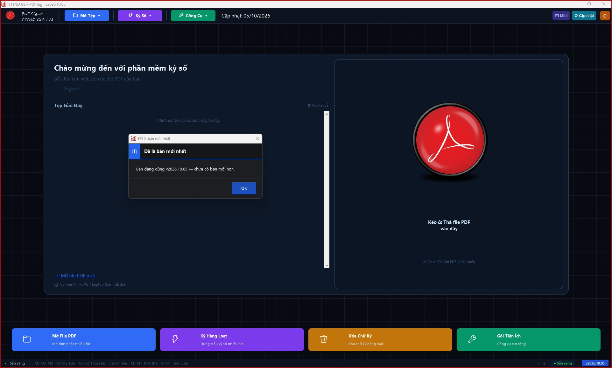

<div align="center">

# ✍️ Tool PDF Sign

**Ký số, đóng dấu, chỉnh sửa và xử lý hàng loạt PDF — dành riêng cho bộ phận văn thư.**  
*Ứng dụng Windows chạy cục bộ 100% trên máy · Nhanh chóng · An toàn · Độc lập*
<br>
[](https://github.com/Kynh31480/Tool_PDF_Sign/releases/latest)

[](https://github.com/Kynh31480/Tool_PDF_Sign/releases/latest)
[](https://github.com/Kynh31480/Tool_PDF_Sign/releases)
[](LICENSE)


[📥 Cài đặt](#-cài-đặt--khởi-động) · [⚡ Quick Start](#-quick-start-3-bước) · [🧭 Hướng dẫn](#-hướng-dẫn-sử-dụng) · [🧰 Tiện ích](#-gói-tiện-ích--xử-lý-hàng-loạt) · [🛟 Sự cố](#-xử-lý-sự-cố)
<br>



<sub>Giao diện nền tối Obsidian Pro, kéo-thả file trực quan, co giãn theo màn hình.</sub>

</div>
---
## 💡 Tại sao nên dùng?
| | |
| :--- | :--- |
| 🏛️ **Đặc thù văn thư** | Tối ưu cho ký duyệt hồ sơ, đóng dấu và xử lý số lượng lớn văn bản mỗi ngày. |
| 📐 **Tự động hóa bố cục** | Lưu vị trí các ô ký thành mẫu (`Layout`), dùng lại cho hồ sơ cùng loại chỉ với một cú bấm. |
| ⚡ **Xử lý hàng loạt** | Theo dõi tiến độ từng file, tự phát hiện lỗi, thử lại, và chọn cách xử lý khi trùng tên file xuất. |
| 🔒 **Offline** | Tài liệu được xử lý ngay trên máy, không tải lên máy chủ nào. |
| 🔓 **Mã nguồn mở** | Phát hành theo giấy phép AGPL-3.0, bạn có thể tự đọc và kiểm tra mã nguồn. |
---
## 📥 Cài đặt & Khởi động

1. Vào **[Releases](https://github.com/Kynh31480/Tool_PDF_Sign/releases/latest)** và tải **`Tool_PDF_Sign.zip`** mới nhất.
2. Giải nén ra một thư mục trên máy (ví dụ Desktop).
3. Bấm đúp **`Tool_PDF_Sign.exe`** trong thư mục vừa giải nén — không cần cài đặt.

> [!IMPORTANT]
> Giữ nguyên cả thư mục sau khi giải nén. **Không tách riêng file `.exe` ra khỏi thư mục** vì ứng dụng cần thư mục `_internal` đi kèm.

> [!TIP]
> **Windows hiện bảng xanh "Windows protected your PC"?** Bấm **More info** → **Run anyway**.  
> Cảnh báo này xuất hiện vì ứng dụng chưa được ký bằng chứng thư số trả phí của Microsoft, không phải do ứng dụng có vấn đề. Bạn có thể kiểm tra file tải về bằng mã SHA-256 ở mục dưới.

<details>
<summary><b>🔐 Kiểm tra toàn vẹn file tải về (SHA-256)</b></summary>

<br>

Mỗi bản phát hành đính kèm file `Tool_PDF_Sign.sha256`. Mở Command Prompt tại thư mục chứa file zip và chạy:

```
certutil -hashfile Tool_PDF_Sign.zip SHA256
```
So sánh chuỗi in ra với nội dung file `.sha256` trong trang Release. Hai chuỗi giống nhau nghĩa là file không bị thay đổi.

</details>

### 💻 Yêu cầu hệ thống

- **Hệ điều hành:** Windows 10 hoặc 11 (**64-bit**).
- **Phần mềm phụ trợ:** Microsoft Office — *chỉ cần* nếu dùng tính năng chuyển Word/Excel sang PDF.
---
## ⚡ Quick Start (3 bước)

1. **Mở tài liệu** — kéo-thả file PDF vào cửa sổ hoặc bấm nút Mở.
2. **Chọn thông tin** — chọn người ký trong danh sách quản lý, áp dụng mẫu bố cục có sẵn.
3. **Hoàn tất** — chỉnh vị trí chữ ký/con dấu trên trang rồi bấm **Lưu**.
---
## 🧭 Hướng dẫn sử dụng

### ✍️ Ký một file

- **Mở tài liệu:** bấm Mở hoặc kéo-thả PDF vào ứng dụng.
- **Chọn người ký:** thêm mới hoặc chỉnh sửa trong *Quản lý người ký*.
- **Định vị:** chọn chế độ **Ký**, kéo chuột trên trang để đặt ô ký hoặc con dấu.
- **Lưu:** bấm **Lưu** để xuất file PDF hoàn chỉnh.

### 📐 Lưu & dùng lại mẫu bố cục

- Sau khi đặt xong các ô ký theo biểu mẫu chuẩn, bấm **Lưu layout làm mẫu**.
- Lần sau với hồ sơ cùng loại, bấm **Quản lý & Load mẫu** để nạp lại toàn bộ vị trí ô ký.

### ⚡ Ký hàng loạt

1. Chọn một hoặc nhiều file PDF → mở bảng **Ký hàng loạt**.
2. Chọn mẫu bố cục và người ký cho cả đợt.
3. Bấm **Xem trước** → **Chạy**. File lỗi được đưa vào hàng đợi để **thử lại**; nếu tên file xuất trùng, ứng dụng sẽ hỏi cách xử lý.

### 🖋️ Sửa chữ gốc trong PDF

Có hai chế độ trên thanh **MODE**:

| Chế độ | Cách dùng |
| :--- | :--- |
| **✎ SỬA CHỮ** | Rê chuột vào chữ để hiện khung → **click** để mở ô sửa tại chỗ. `Enter` lưu · `Esc` huỷ · `Tab` mở thanh định dạng. |
| **DI CHUYỂN** | Click chọn chữ → kéo đến vị trí mới → thả chuột. |
---

## ✨ Tính năng chi tiết

### ✍️ Ký & quản lý người ký

- **Chữ ký / con dấu:** chèn ảnh chữ ký, con dấu cơ quan hoặc tạo trường chữ ký số (*signature field*).
- **Quản lý người ký:** lưu tên, chức vụ, vai trò, nhóm; tự sao lưu sau mỗi lần chỉnh sửa.
- **Mẫu bố cục:** lưu tọa độ các ô ký để nạp lại cho hồ sơ sau.

### 🖋️ Chỉnh sửa trực tiếp trên tài liệu

- Các chế độ: Ký tên, chèn ảnh, che nội dung (*Whiteout*), chèn/sửa chữ, tô sáng (*Highlight*), di chuyển chữ gốc, vẽ hình cơ bản, gắn liên kết (*Hyperlink*) và bookmark.
- **Tìm & thay thế** văn bản trực tiếp trên trang.
- **Hoàn tác / làm lại** từng bước; tự vá lỗi cấu trúc tham chiếu (`xref`) khi gặp file hỏng nhẹ.

---

## 🧰 Gói tiện ích · Xử lý hàng loạt

Chọn nhiều file, xếp các bước vào hàng đợi và chạy cả quy trình bằng một lần bấm:

| **Tiện ích** | **Công dụng** |
| :--- | :--- |
| 📘 **Word → PDF hàng loạt** | Chuyển nhiều tài liệu Word sang PDF *(cần Microsoft Office)* |
| 📗 **Excel → PDF hàng loạt** | Chuyển nhiều bảng tính Excel sang PDF *(cần Microsoft Office)* |
| 🔢 **Đánh số trang** | Chèn số trang vào góc hoặc giữa trang |
| 🖼 **Trích xuất ảnh → ZIP** | Lấy toàn bộ ảnh nhúng trong PDF ra file ZIP |
| 🧹 **Xóa metadata** | Dọn thông tin ẩn và lịch sử chỉnh sửa |
| 🗑️ **Trường ký (vĩnh viễn)** | Dọn form/widget chữ ký cũ — *không thể hoàn tác* |
| 🧊 **Làm phẳng (Flatten)** | "In chết" chữ ký, con dấu vào lớp nền trang |
| 🚫 **Xóa ảnh nhúng** | Loại bỏ toàn bộ hình ảnh trong file |
| 🖍️ **Xóa highlight** | Gỡ mọi vùng tô sáng |
| 🗜️ **Nén / tối ưu** | Giảm dung lượng, giữ chất lượng |
| 🔁 **Ký lại — chỉnh vị trí** | Xóa trường ký cũ để đặt lại tọa độ mới |
| ↻ **Xoay trang** | Xoay toàn bộ hoặc một phần trang |

> [!WARNING]
> Các tiện ích **xóa dữ liệu** (xóa trường ký, xóa ảnh nhúng…) tác động trực tiếp lên file kết quả. Hãy thao tác trên **bản sao** để giữ an toàn cho tài liệu gốc.

---

## 🔒 Bảo mật & quyền riêng tư

> [!IMPORTANT]
> **100% Offline:** tài liệu PDF được xử lý cục bộ trên máy bạn, **không tải lên máy chủ hay dịch vụ đám mây nào**. Ứng dụng chỉ kết nối internet ngắn khi kiểm tra hoặc tải bản cập nhật từ GitHub.

| **Dữ liệu** | **Nơi lưu** |
| :--- | :--- |
| Danh sách người ký (`signers.json`) và bản sao lưu | Thư mục cấu hình cục bộ của hệ thống |
| Các mẫu bố cục (Layouts) | Thư mục cấu hình cục bộ của hệ thống |
| Nhật ký (`pdfsign.log`) | Cùng thư mục với ứng dụng — **chỉ sinh ra khi có lỗi** |

---

## 🛟 Xử lý sự cố

| **Hiện tượng** | **Cách giải quyết** |
| :--- | :--- |
| **"Windows protected your PC"** | Bấm **More info** → **Run anyway** (ứng dụng chưa được ký bằng chứng thư số trả phí). |
| **Lỗi xuất PDF từ Word / Excel** | Máy chưa cài Microsoft Office. Các tính năng PDF khác vẫn dùng bình thường. |
| **Không tự cập nhật** | Mạng tới GitHub bị gián đoạn — tải `.zip` mới từ [Releases](https://github.com/Kynh31480/Tool_PDF_Sign/releases/latest), giải nén và chạy đè. |
| **Lỗi khác** | Gửi file `pdfsign.log` (nếu có trong thư mục ứng dụng) để được phân tích. |

Lịch sử đầy đủ: [Releases](https://github.com/Kynh31480/Tool_PDF_Sign/releases).
---

## ⚖️ Giấy phép

Phát hành theo **GNU Affero General Public License v3.0** — xem file [LICENSE](LICENSE).  
Copyright © 2026 Nguyễn Hồng Kỳ & Đoàn Nhân Hiếu — TTTND Gia Lai.

<div align="center">
<sub>Tác giả: Nguyễn Hồng Kỳ & Đoàn Nhân Hiếu · TTTND Gia Lai</sub>
</div>
